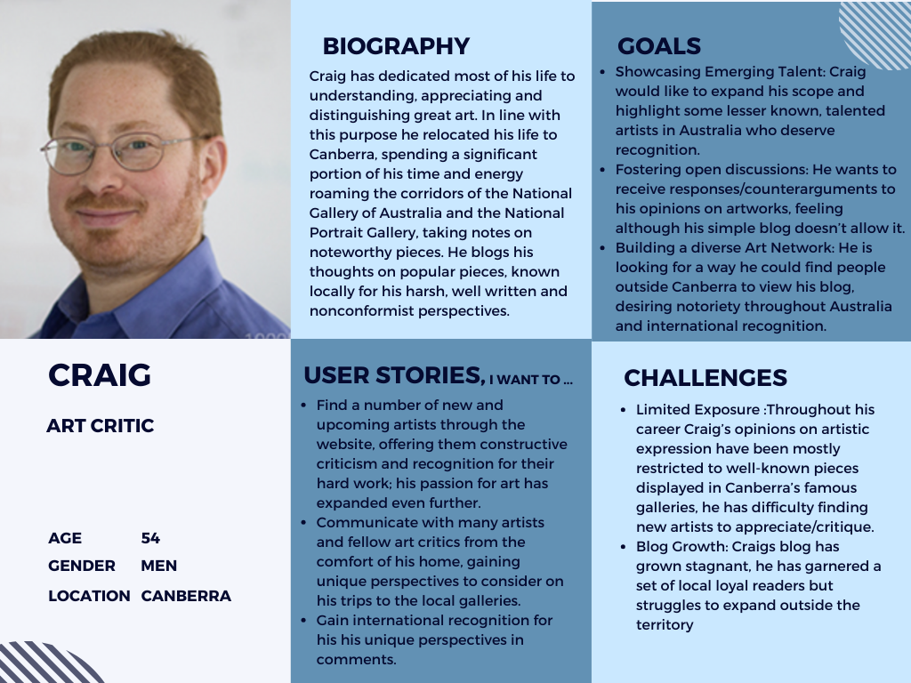

# Online Art Gallery Documentation

## The problem:

The problem we are aiming to solve with this website is the difficulty for new and experienced artists to gather attention towards their artworks and meet people with a similar or compatible taste in art.

## The solution/purpose:

Our idea is for an Online art gallery where artists and art enthusiasts can gather to show off their work, gain some attention towards it, and share their opinions with other like-minded people. This web application will attempt to help talented artists, no matter their circumstances, to get some publicity for their hard work. The site will also serve as a supportive place for new artists to show off their artistic projects and learn, gather inspiration from, and connect with others working in similar mediums. We believe this type of website will also have a number of transferable skills for common web development projects e.g. blogs, portfolio sites, etc.

## Functionality/features:

### Artists:

- Can create/delete an account
  - can upload their artworks to be displayed
  - can add a title
  - description/artist-statement
  - genre
  - medium
- Can create/update/delete content related to an artist profile with information about themselves and their practice
- Can view other artists profiles
  - sort by name, categories such as art-genre, medium, etc
- Can view all comments and report inappropriate comments on their own artworks
- Can view/create/update/delete comments they made on others artworks

### Art-lovers:

- Can create/delete an account
- Can view Artwork uploaded by Artists
  - Sort by name, categories such as art-genre, medium, etc
- Can create/update/delete comment on pieces of art
- Can view all comments and report inappropriate comments on pieces of art
- Can view all comments made by themselves

### Admins:

- Can view all login users' artworks or comments
- Can delete artworks not suitable for the website
- Can delete Artist accounts not suitable for the website
- Can delete comments not suitable for the website

--- 

## Components:    

### Onboarding:  
* Stylised animation upon opening?
* Sign up
  * Create username
  * Create password
  * Optional: add profile picture
* Sign in
  * Requires username
  * Requires password
* Select language

### Home page:  
* Header
  * Logo
  * Search Bar for artists and artwork titles
* Dropdown selection to refine genre/medium
* Selection of recommended artworks
  * frequently viewed genres/mediums/artists
* Footer
  * Mock links to socials

### Explore 
* Dropdown selection to refine genre/medium
* Random artworks ^^
  * Artist
    * Genre/medium
  * Comments
    * Button to leave a comment
  * Report button 

### Profile page   
* Profile picture
* Username
* User bio/description
* User artworks
   * Comments on artworks
   * Artwork activity
* Settings
   * Update account
   * Delete account 

## User Persona:

### Experienced Artist

### Emerging Artist

### Art Critic

### Art Enthusiast

### Unintentional Visitor

## Application Architecture Diagram

## Tech Stack:

We decided on the MERN tech stack for this project, choosing MongoDB for the database, ExpressJS and NodeJS were selected for the back-end server and the front-end web client is handled by React. The use of MERN stack allows for flexible, non-repetitive and scalable full-stack design.

### Libraries:

- JWT:
- Bcrypt:
- Dotenv:
- Cors:

#### Front End:

- HTML:
- CSS:
- JavaScript:
- APIs:
- React-router-dom:
- React-bootstrap:

#### Back End:

- Express:
- Mongoose:

---

## Trello Board:

#### [Trello Link](https://trello.com/b/v5aGv47r/online-art-gallery)

