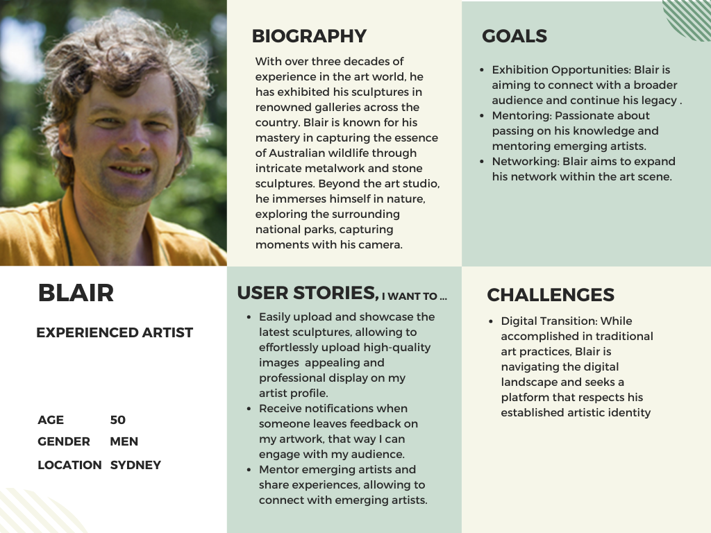
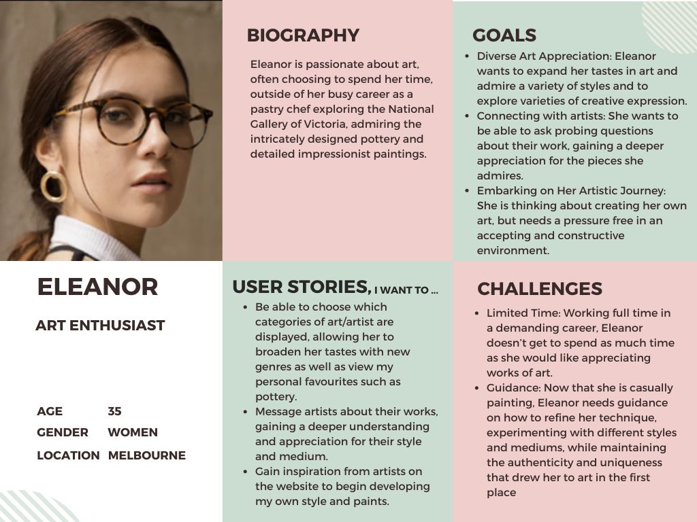
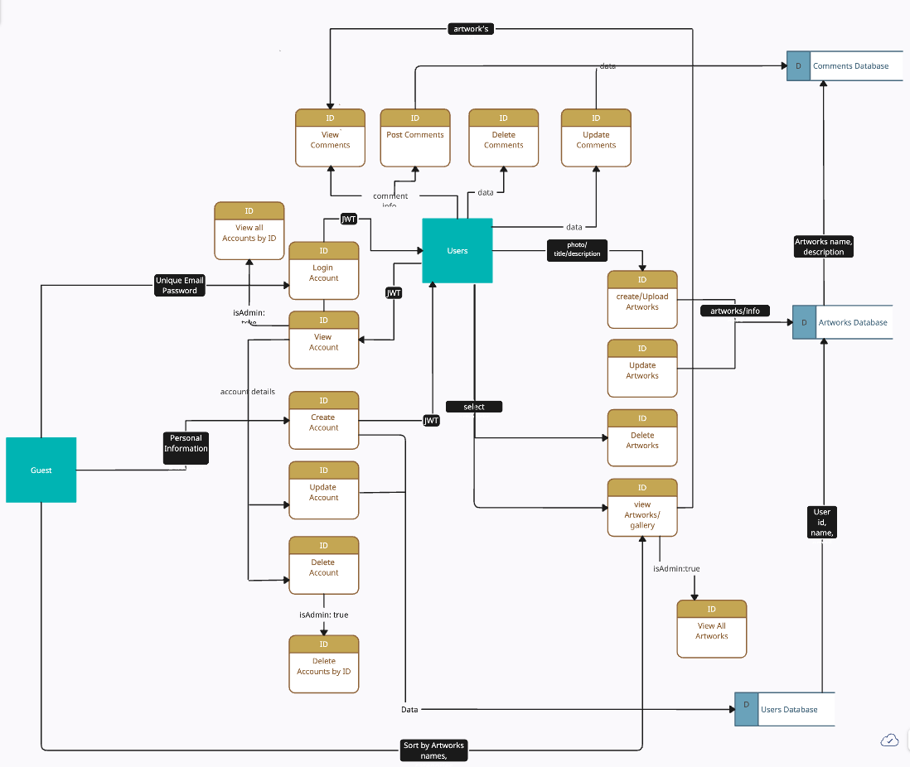

# ArtistConnect Online Art Gallery Documentation 
#### [GitHub Link](https://github.com/Online-Art-Gallery/Documentation)
___

## The problem:

The problem we are aiming to solve with this website is the difficulty for new and experienced artists to gather attention towards their artworks and meet people with a similar or compatible taste in art.

---

## The solution/purpose:

Our idea is for an Online art gallery where artists and art enthusiasts can gather to show off their work, gain some attention towards it, and share their opinions with other like-minded people. This web application will attempt to help talented artists, no matter their circumstances, to get some publicity for their hard work. The site will also serve as a supportive place for new artists to show off their artistic projects and learn, gather inspiration from, and connect with others working in similar mediums. We believe this type of website will also have a number of transferable skills for common web development projects e.g. blogs, portfolio sites, etc.

---

## Functionality/features:

### Artists/users:

- Can create/delete an account
  - can upload their artworks to be displayed
  - can add a title
  - description/artist-statement
  - genre
  - medium
- Can create/update/delete content related to an artist profile with information about themselves and their practice
- Can view other artists profiles
  - sort by name, categories such as art-genre, medium, etc
- Can view all comments and report inappropriate comments on their own artworks
- Can view/create/update/delete comments they made on others artworks

### Admins:

- Can view and delete reported artworks through the backend

---

## Components:

### Home page:

- Header
  - Logo
  - Nav link to explore page
  - Link to create account / Profile picture and username link to profile page
- Selection of recommended artworks
- Description/purpose of website
- Footer
  - Mock links to socials

### Explore

- Search bar to find a specific artwork
- Artworks
    - Title
    - Description
    - Button to leave a comment
    - Report button
    - Favourite button

### Profile page

- Profile picture
- Upload artwork button
- Username
- User bio/description
- Gallery
  - User Artworks
  - User favourite artworks
- Settings
  - Update account
  - Delete account

### Components List: 
1. Logo - clickable 
2. Navbar with “explore” button 
3. Button Login
4. Login Form
5. Registration Form to create the account 
6. Artworks for home page.
7. Footer with links to social media
8. Upload photo Profile 
9. Setting Account Form
10. Upload Artwork  Button 
11. Upload Artwork Form 
12. Card Artwork uploaded with heart and comments button 
13. Gallery with cards of the artworks 
14. My Artworks button 
15. Favourite Artworks button 
16. Comments component 
17. Search Bar 

---

## User Persona:

### Experienced Artist

### Emerging Artist

### Art Critic

### Art Enthusiast

### Unintentional Visitor

## 

---

## Dataflow Diagram:

## 

---

## Application Architecture Diagram:

---

## Wireframes:

### Home Page:
#### Desktop
 
#### Mobile

### Login Page:
#### Desktop
 
#### Mobile

### Create profile Page:

#### Desktop
 
#### Mobile
 

### Profile Page:

### Explore Page:

### Setting Page:

### Upload Artwork Page:

### Artwork Uploaded Page:

### Gallery Page:

### Comments Page:

### Admin Page:

### Logo:

### Colour Palette:

## Tech Stack:

We decided on the MERN tech stack for this project, choosing MongoDB for the database, ExpressJS and NodeJS were selected for the back-end server and the front-end web client is handled by React. The use of MERN stack allows for flexible, non-repetitive and scalable full-stack design.

### Libraries:

### Back End

* `bcrypt` is used for hashing our user's passwords, this library is commonly used for user authentication.
* `bcryptjs` this library for password hashing as well, it is used in conjunction with bcrypt.
* `cloudinary`is a cloud service that provides image management. Useful for handling and storing user's image avatars and artworks files.
* `cors`is a middleware for Express.js that was used to manage and control access to resources on the server from different domains. It allows or restricts cross-origin HTTP requests, which is essential for security. 
* `dotenv` Zero-dependency Node.js module that simplifies the process of loading environment variables, managing the configuration settings, API keys, database connection strings, and other sensitive information.
* `express`is a web application framework for Node.js that helps to simplify the creation of APIs (routes for different HTTP methods) and web servers. 
* `express-async-handler` handles asynchronous errors in Express.js middleware and route handlers.

* `jsonwebtoken` creates and verifies JSON Web Tokens (JWT) used for secure communication between parties.

* `mongoose` is an Object Data Modeling (ODM) library for MongoDB and Node.js that helps to simplify interactions with MongoDB databases. It was used for the schemas definition and models creation, also CRUD operations middleware and more. 

### Front-End 

* `axios` is the library used to make HTTP requests. 
* `tailwindcss`  utility-first CSS framework, used to styled  the front end. 
* `reduxjs Version 2.0.1/toolkit ` is an efficient tool to develop, simplify the process of managing state in React applications.
*`jest-dom Version 5.17.0/testing-library` matchers for validating the state of the DOM in our tests.

* `user-event Version 13.5.0/testing-library`
---

## Trello Board:

#### [Trello Link](https://trello.com/b/v5aGv47r/online-art-gallery)

